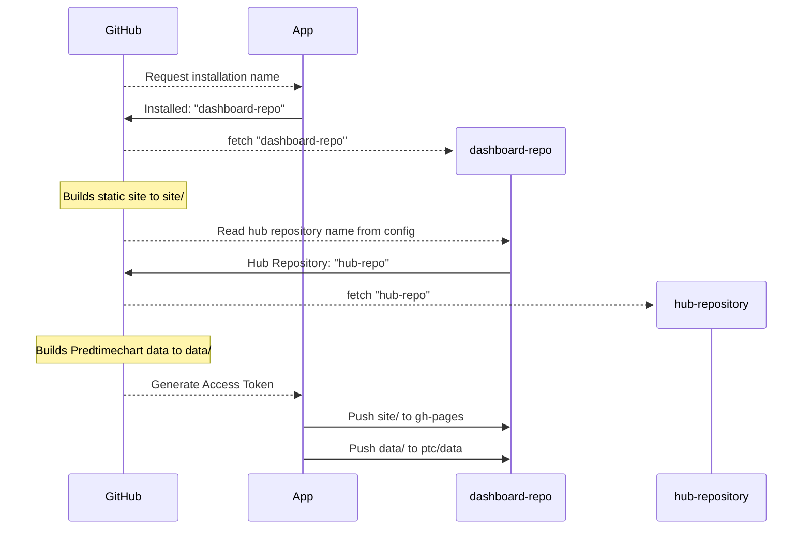

# hub-dashboard-control-room

> [!NOTE]
>
> This project is a proof of concept. It may not work with all repositories.

This repository contains operational workflows for the [hubDashboard App](https://github.com/apps/hubDashboard).
The workflow will generate predtimechart data and build a static site for each
repository that installed the app.

The workflow then looks like this for each repository 
(note the build processes are in parallel):



In the two sections below, I detail the general implementations.

### Predtimechart data

The general steps to generate the data for predtimechart are:

1. install 
   [hub-dashboard-predtimechart](https://github.com/hubverse-org/hub-dashboard-predtimechart)
   via
   ```bash
   pip install --upgrade pip
   pip install git+https://github.com/hubverse-org/hub-dashboard-predtimechart
   ```
2. clone the dashboard repository and enter it (you only need the `predtimechart-config.yml`)
3. clone the hub repository into `repo/`
4. Generate the Predtimechart data
   ```bash
   mkdir -p out/targets/
   mkdir -p out/forecasts/
   ptc_generate_flusight_targets \
     repo \
     out/targets
   ptc_generate_json_files \
     repo \
     predtimechart-config.yml \
     out/predtimechart-options.json \
     out/forecasts
   ```
5. enter `repo/` and checkout the `ptc/data` branch
6. copy the contents of `../data` to your current folder
7. add, commit, and push


### Static Site

The static site is generated via the [hubverse-org/hub-dash-site-builder
container](https://github.com/hubverse-org/hub-dash-site-builder/pkgs/container/hub-dash-site-builder)
and writes a folder called `_site/` under the `pages/` folder of the dashboard
repository. You need to then copy the contents of `_site/` into the `gh-pages`
branch of the dashboard repository. 


1. clone the dashboard repository
2. Run the container:
   ```bash
   $ docker run \
     --platform=linux/amd64 \
     --rm \
     -ti \
     -v "/path/to/dashboard/repo":"/site" \
     ghcr.io/hubverse-org/hub-dash-site-builder:main \
     bash render.sh \
       ${dashboard repo org} \
       ${dashboard repo name} \
       "ptc/data"
   ```
3. clone the gh-pages branch of the dashboard repository into `pages/`
4. copy the files from the `dashboard repo/site/pages/_site/` folder into `pages/`
5. push the `pages/` folder up. 

